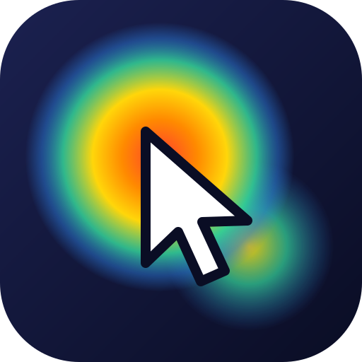

# Heatmap



Công cụ cho phép **nhập một đường link** (website, file HTML trên máy, hoặc **prototype Figma**), mở trang đó cho người dùng duyệt và **thu thập tương tác** của họ trên trang:

- 👁 **Ánh mắt** qua webcam (dùng [WebGazer.js](https://webgazer.cs.brown.edu/), chạy hoàn toàn trên trình duyệt, không gửi hình ảnh camera đi đâu)
- 🖱 Di chuột, click (kèm phần tử được click), focus vào ô nhập liệu (không ghi nội dung gõ)
- 📜 Cuộn trang, kích thước khung nhìn, các trang đã chuyển tới

Sau phiên test có trang **báo cáo**: heatmap ánh mắt / chuột / click, scanpath (chuỗi điểm dừng mắt), phát lại theo thời gian, thống kê, **biểu đồ** và xuất JSON/CSV. Có thể gộp nhiều phiên cùng một link để xem heatmap tổng hợp.

### Có gì mới ở Heatmap 4.1

- **Ghi màn hình trình duyệt**: trên thanh trình duyệt có nhóm nút **● Record | ❚❚ Pause | ■ Stop** và đồng hồ. Video chỉ chứa khung trình duyệt (không có cột camera hay thanh công cụ), ghi dạng **MP4 (H.264)** mở được bằng QuickTime trên Mac (trình duyệt không hỗ trợ MP4 thì ghi WebM). Mỗi đoạn 4 giây được lưu ngay nên không mất dữ liệu nếu app bị tắt giữa chừng. Một phiên có thể có nhiều video; xem, tải về hoặc xoá trong mục **Recordings** của báo cáo.
- **Ghi âm micro** khi bật eye tracking bằng webcam: tuỳ chọn *Record audio from the microphone* ngay dưới ô eye tracking ở trang chủ. Trong lúc ghi có chip 🎙 (tạm dừng / tiếp tục). Báo cáo có trình phát và nút tải về **WAV**.
- **Transcript tiếng Việt / tiếng Anh** trên màn hình riêng (báo cáo → *Transcript & summary*): nhận dạng giọng nói bằng **Whisper chạy ngay trên máy** (transformers.js, dùng GPU qua WebGPU nếu có, không thì CPU). Mô hình tải một lần từ Hugging Face rồi lưu trong thư mục dữ liệu, các lần sau dùng offline; âm thanh không rời khỏi máy. Chọn mô hình *Base* (nhanh), *Small* (khuyên dùng) hoặc *Large v3 Turbo* (chính xác nhất). Bấm mốc thời gian để nghe lại, bấm vào chữ để sửa, **Lưu**, **Xuất Word (.docx)** hoặc **.txt**.
- **Tóm tắt bằng AI** (Claude, model `claude-opus-5-5`): đọc transcript cùng dòng thời gian click / trang đã mở của phiên, viết *Tổng quan, Vấn đề gặp phải, Điểm tốt, Đề xuất, Câu nói đáng chú ý* bằng tiếng Việt hoặc tiếng Anh. Sửa được, sao chép được và được đưa vào file Word. Cần Anthropic API key của bạn (⚙ Settings → *AI summary*, hoặc biến môi trường `ANTHROPIC_API_KEY`); key chỉ lưu trên máy và trang web không bao giờ đọc lại được. Yêu cầu bật **fallback phía server** (`fallbacks: "default"`): nếu bộ lọc an toàn từ chối, API tự chạy lại trên mô hình dự phòng được Anthropic khuyến nghị.

Heatmap 4.1 là bản nâng cấp của Heatmap 4.0 (cùng app, cài đè và giữ nguyên dữ liệu).

### Có gì mới ở Heatmap 4.0

- **Cột camera ẩn/hiện**: khi đang ghi, cột webcam cạnh trình duyệt **mặc định ẩn** để trình duyệt chiếm toàn màn hình; bấm nút **📷** trên thanh trình duyệt để hiện/ẩn (lựa chọn được nhớ, cũng chỉnh được trong ⚙ Settings). Trong lúc hiệu chỉnh 9 điểm, cột camera tự hiện để người dùng căn mặt. Đồng hồ ghi và nút *Finish* nằm trên thanh trình duyệt nên luôn dùng được.
- **Biểu đồ "Most clicked elements"** trong báo cáo từng phiên (số click theo từng phần tử của trang đang xem).
- **Vị trí lưu trữ** (⚙ Settings → *Storage location*): chọn thư mục trên máy để lưu phiên và kịch bản (app desktop có nút *Choose folder…* và *Open folder*). Dữ liệu hiện có được chuyển sang thư mục mới; *Use default* để quay về thư mục mặc định.
- **Recorded sessions**:
  - cột **Recorded time** (thời lượng ghi) và cột **Scenario**;
  - mỗi phiên có **Save as…** (app desktop: chọn nơi lưu, định dạng JSON đầy đủ hoặc CSV sự kiện; bản web: tải file JSON) và **Show file** (app desktop: mở file dữ liệu gốc của phiên trong Finder);
  - nút **Report for all sessions** → trang báo cáo tổng hợp **chia theo Link**: số phiên, người tham gia, thời gian TB/tổng, click TB, độ sâu cuộn TB, độ chính xác TB, lần ghi gần nhất, kèm biểu đồ và nút *Merged heatmap* (heatmap gộp mọi phiên của link đó).
- **Kịch bản (scenario / folder)**: tạo kịch bản để gom nhiều phiên; chọn kịch bản ngay khi bắt đầu phiên, hoặc tick nhiều phiên rồi *Move to scenario* / *Remove from scenario*. Lọc danh sách và báo cáo tổng hợp theo kịch bản; đổi tên hoặc xoá kịch bản (xoá kịch bản không xoá phiên).

Heatmap 4.0 là bản nâng cấp của Heatmap 3.0 (cùng app, cài đè và giữ nguyên dữ liệu).

### Có gì mới ở Heatmap 3.0

- **Tên & logo mới**, là app độc lập với "Eye Tracking Tool" và "Eye Tracking Studio" (khác mã ứng dụng `com.heatmap.desktop`, khác thư mục dữ liệu `~/Library/Application Support/Heatmap`), cài song song không ảnh hưởng nhau.
- **Song ngữ English / Tiếng Việt**, mặc định English. Đổi bằng nút **EN | VI** trên header (trang chủ và báo cáo) hoặc trong **⚙ Settings**. Menu của app desktop cũng đổi theo.
- **Settings → Webcam eye tracking**: bật/tắt toàn bộ tính năng eye tracking bằng webcam. Khi tắt, tuỳ chọn webcam bị ẩn, phiên mới chỉ ghi chuột/click/cuộn, khung camera và các chỉ số ánh mắt cũng được ẩn (app không hỏi quyền camera).
- **2 tab nhập link test**:
  - *Website / file*: link http(s) hoặc file HTML trên máy (`file:///…`, chỉ app desktop).
  - *Figma prototype*: dán link prototype Figma (`https://www.figma.com/proto/…`; link `/design/…` cũng được, sẽ tự chuyển sang chế độ prototype, ẩn thanh công cụ Figma và co vừa khung). Mỗi màn hình (`node-id`) được ghi thành một trang riêng trong báo cáo.
- **Biểu đồ trong báo cáo**: *Attention over time* (mức chú ý theo thời gian), *Attention by page depth* (tỉ lệ chú ý theo từng phần mười chiều cao trang), *Time on each page*, *Clicks on each page*. Có tooltip khi rê chuột/focus bàn phím và bảng số liệu cho từng biểu đồ.

**Figma — lưu ý:** trong **app desktop**, prototype chạy trong trình duyệt thật nên ghi đủ ánh mắt, chuột, click và từng màn hình; có thể đăng nhập Figma ngay trong khung trình duyệt để xem file riêng tư. Ở **bản web**, Figma được nhúng bằng Figma Embed (khác origin) nên chỉ ghi được ánh mắt và việc chuyển màn hình (khi Figma gửi sự kiện), không ghi được chuột/click bên trong.

## Chạy

Yêu cầu Node.js ≥ 18.

```bash
npm install
npm start
# mở http://localhost:3000/__et/
```

Biến môi trường:

| Biến | Mặc định | Ý nghĩa |
|---|---|---|
| `PORT` | `3000` | Cổng server |
| `HOST` | `127.0.0.1` | Địa chỉ lắng nghe (đặt `0.0.0.0` để máy khác truy cập) |
| `DATA_DIR` | `./data` | Thư mục lưu dữ liệu phiên |
| `ALLOW_PRIVATE` | _(tắt)_ | Đặt `1` để cho phép test các trang trong mạng nội bộ / localhost |
| `NODE_USE_ENV_PROXY` | _(tắt)_ | Đặt `1` nếu máy phải ra Internet qua proxy (`HTTPS_PROXY`) |

> Webcam chỉ hoạt động trong *secure context*: dùng `http://localhost` khi chạy trên máy mình, hoặc HTTPS nếu triển khai cho người khác truy cập.

## Ứng dụng macOS (.dmg)

Công cụ có thể chạy như một ứng dụng desktop (Electron): server chạy ngay bên trong app, không cần cài Node.js, dữ liệu lưu ở `~/Library/Application Support/Heatmap/sessions`, mỗi kịch bản một thư mục, mỗi phiên một thư mục con (xem *Cách lưu file*; menu **Dữ liệu → Mở thư mục dữ liệu**, hoặc đổi nơi lưu trong ⚙ Cài đặt).

> **Heatmap 3.0** độc lập với các bản trước ("Eye Tracking Tool" 1.0, "Eye Tracking Studio" 2.0): khác mã ứng dụng, khác thư mục dữ liệu, nên cài song song được và không ghi đè hay dùng chung dữ liệu. Muốn gỡ bản cũ: xoá app đó trong Applications (dữ liệu cũ nằm ở `~/Library/Application Support/<tên app cũ>`).

**Tải bản build sẵn:** GitHub Actions (workflow `Build macOS app (.dmg)`) build file `.dmg` trên máy macOS khi chạy tay (*Actions → Run workflow*) hoặc khi push tag `v*`, rồi đính kèm ở mục *Artifacts* của lần chạy:

- `Heatmap-<version>-arm64.dmg` cho Mac chip Apple (M1/M2/M3/M4)
- `Heatmap-<version>-x64.dmg` cho Mac chip Intel

**Tự build trên Mac:**

```bash
npm install
npm run app        # chạy thử ứng dụng desktop
npm run dist:mac   # tạo file .dmg trong thư mục dist/
```

**Lần mở đầu tiên:** app được ký ad-hoc, chưa ký bằng Apple Developer ID / notarize, nên macOS sẽ chặn với thông báo "không thể xác minh nhà phát triển". Kéo app vào *Applications*, sau đó:

- Chuột phải vào app → **Open** → **Open**, hoặc
- *System Settings → Privacy & Security* → kéo xuống, bấm **Open Anyway**, hoặc
- chạy `xattr -dr com.apple.quarantine "/Applications/Heatmap.app"`

Khi bắt đầu phiên có eye tracking, macOS sẽ hỏi quyền **Camera** (và **Microphone** nếu bật ghi âm). Lần đầu bấm **Record**, macOS hỏi quyền **Screen Recording**: bật Heatmap trong *System Settings → Privacy & Security → Screen & System Audio Recording* rồi mở lại app. Nếu lỡ từ chối quyền nào, bật lại tại *System Settings → Privacy & Security*.

> Để phát hành cho nhiều người mà không bị cảnh báo, cần tài khoản Apple Developer: đặt `CSC_LINK`/`CSC_KEY_PASSWORD` (chứng chỉ Developer ID) và `APPLE_ID`/`APPLE_APP_SPECIFIC_PASSWORD`/`APPLE_TEAM_ID` để electron-builder ký và notarize, rồi bỏ `"identity": "-"` trong `package.json`.

## Cách dùng

1. Trang chủ: nhập link, tên người tham gia, bật/tắt eye tracking → **Bắt đầu theo dõi**.
   - Link có thể là `http(s)://…` hoặc **file HTML trên máy** (chỉ trong app desktop): `file:///Users/admin/Downloads/example.html`, đường dẫn `/Users/admin/Downloads/example.html`, hoặc bấm **Chọn file…**. Link tương đối giữa các file trong cùng thư mục (ví dụ `page2.html`, `css/style.css`) hoạt động bình thường.
2. Cho phép truy cập camera, làm **hiệu chỉnh 9 điểm** (nhìn vào chấm đỏ và click 5 lần mỗi chấm), sau đó nhìn chấm vàng 5 giây để đo độ chính xác. Nên đạt ≥ 70%; nếu thấp hãy hiệu chỉnh lại (ánh sáng đều, mặt nhìn thẳng camera, không di chuyển đầu).
3. Người dùng duyệt trang như bình thường. Màn hình theo dõi gồm **2 khung song song**:
   - **Trái — webcam**: hình camera trực tiếp kèm lưới nhận diện khuôn mặt, trạng thái (có thấy mặt không), bản đồ "đang nhìn vào đâu" trong khung trình duyệt, thống kê trực tiếp (độ chính xác, số mẫu ánh mắt/giây, click, số trang, sự kiện đã lưu) và các nút *Hiện điểm nhìn*, *Hiệu chỉnh lại*, *Kết thúc*.
   - **Phải — trình duyệt**: thanh địa chỉ (gõ link mới rồi Enter), nút lùi / tiến / tải lại. Trong **app desktop** đây là trình duyệt Chromium thật mở thẳng website (không qua proxy, chạy y như Chrome). Trong bản web, trang được hiển thị qua proxy của server.
4. Bấm **Kết thúc & xem báo cáo**.

## Cách hoạt động

```
http://localhost:3000
├── /__et/…            giao diện công cụ (trang chủ, theo dõi, báo cáo, API, WebGazer)
├── /__et/go?url=…     chọn site đích (lưu trong cookie) rồi chuyển tới đúng đường dẫn
└── mọi đường dẫn khác reverse proxy tới site đích, GIỮ NGUYÊN đường dẫn
                        (https://site.vn/san-pham?id=1 → http://localhost:3000/san-pham?id=1)
```

**App desktop (Electron)** — khung trình duyệt là `<webview>` mở thẳng website. Bộ ghi tương tác (`public/recorder.js`) được nạp qua preload của webview (`electron/guest-preload.js`), chạy ở "isolated world" nên website không thấy hay can thiệp được, rồi gửi sự kiện về màn hình theo dõi qua IPC. Webview dùng phiên trình duyệt riêng (`persist:browse`), không được xin quyền camera/vị trí/thông báo; link mở tab mới được mở ngay trong khung để tiếp tục ghi.

**Bản web** — trình duyệt không cho đọc tương tác bên trong iframe khác origin, nên server làm **reverse proxy**: trang đích được phục vụ dưới cùng origin với công cụ, nhờ vậy trang theo dõi gắn được listener vào tài liệu trong iframe. Vì đường dẫn được giữ nguyên, các SPA (Next.js, Nuxt, React Router…) vẫn định tuyến đúng, và các lệnh `fetch`/XHR tương đối của trang cũng đi qua proxy tới server gốc. Việc chuyển trang bằng `history.pushState` cũng được ghi thành lượt xem mới.

Toạ độ ánh mắt từ WebGazer (tính theo màn hình) được quy đổi sang **toạ độ trên tài liệu** (cộng thêm vị trí cuộn), nên heatmap vẫn đúng chỗ khi người dùng cuộn trang.

Mỗi sự kiện lưu: `t` (ms từ lúc bắt đầu), `type`, `page`, `x/y` (toạ độ trong tài liệu), `vx/vy` (toạ độ trong khung nhìn), `vw/vh/dw/dh` (kích thước khung nhìn / tài liệu), `sx/sy` (vị trí cuộn), `el` (mô tả phần tử với click/focus).

### Cách lưu file

Mỗi kịch bản là một thư mục, mỗi phiên là một thư mục con đặt theo tên người tham gia:

```
<thư mục lưu trữ>/                      (mặc định: data/sessions, app Mac: ~/Library/Application Support/Heatmap/sessions)
├── Droppii Mall/                       kịch bản
│   ├── User 1/                         phiên của người tham gia "User 1"
│   │   ├── session.json                toàn bộ dữ liệu phiên (thông tin + mọi sự kiện)
│   │   ├── events.csv                  bảng sự kiện
│   │   ├── screen-recording-1.mp4      video ghi màn hình (mỗi lần Record một file)
│   │   ├── audio-recording-1.m4a       ghi âm
│   │   ├── transcript.json             transcript + tóm tắt AI (nếu có)
│   │   └── .session.json, .events.ndjson   file làm việc của app (ẩn)
│   └── User 1 (2)/                     trùng tên người tham gia → thêm số
└── No scenario/                        phiên chưa thuộc kịch bản
```

- Phiên không nhập tên người tham gia được đặt tên `Session <ngày> <giờ>`.
- `session.json` và `events.csv` tự cập nhật vài giây sau mỗi thay đổi và ngay khi kết thúc phiên.
- Chuyển phiên sang kịch bản khác (kéo-thả hoặc *Chuyển vào kịch bản*) sẽ chuyển cả thư mục. Đổi tên kịch bản thì đổi tên thư mục. Xoá kịch bản thì các phiên chuyển sang `No scenario`.
- Có thể đổi tên thư mục phiên bằng Finder, app vẫn nhận ra (mã phiên nằm trong `.session.json`).
- Nút **Mở thư mục** ở mỗi phiên (app desktop) mở thẳng thư mục của phiên đó.
- Dữ liệu lưu theo cách cũ (mọi file chung một thư mục `sessions/<id>.*`) được tự động chuyển sang cách mới khi mở app.

### API

| Method | Đường dẫn | Mô tả |
|---|---|---|
| `POST` | `/__et/api/sessions` | Tạo phiên `{ url, participant, eyeTracking }` |
| `GET` | `/__et/api/sessions` | Danh sách phiên |
| `GET` | `/__et/api/sessions/:id` | Thông tin phiên + toàn bộ sự kiện |
| `POST` | `/__et/api/sessions/:id/events` | Gửi lô sự kiện `{ events: [...] }` |
| `PATCH` | `/__et/api/sessions/:id` | Cập nhật `{ ended, calibration }` |
| `DELETE` | `/__et/api/sessions/:id` | Xoá phiên |
| `GET` | `/__et/api/sessions/:id/export?format=csv\|json` | Tải dữ liệu |
| `POST` | `/__et/api/sessions/:id/media/:mediaId` | Gửi một đoạn video/âm thanh (đoạn đầu kèm `?kind=screen\|audio&mime=…&t=…`) |
| `POST` | `/__et/api/sessions/:id/media/:mediaId/finish` | Kết thúc bản ghi `{ endT, durationMs }` |
| `GET`/`DELETE` | `/__et/api/sessions/:id/media/:mediaId` | Phát (hỗ trợ Range), tải (`?download=1`), xoá bản ghi |
| `GET`/`PUT` | `/__et/api/sessions/:id/transcript` | Đọc / lưu transcript `{ audioId, language, model, segments, summary? }`; `?format=docx\|txt` để xuất |
| `POST` | `/__et/api/sessions/:id/transcript/summary` | Tạo tóm tắt AI `{ language: "vi"\|"en" }` |

## Giới hạn cần biết

- **Độ chính xác của eye tracking qua webcam** thường khoảng 100–200px — đủ để biết người dùng chú ý vùng nào, không đủ để biết họ đọc từ nào.
- **Trang qua proxy có thể hiển thị khác bản gốc**: trang gọi API bằng URL tuyệt đối tới domain khác cần CORS, trang có tường lửa chống bot (Cloudflare challenge…) hoặc đăng nhập bằng bên thứ ba có thể không chạy đúng. Service worker của trang bị tắt. Mỗi trình duyệt chỉ theo dõi một site đích tại một thời điểm (lưu trong cookie).
- Trang báo cáo tải lại link ở thời điểm xem, nên nội dung có thể đã thay đổi so với lúc ghi.
- **Bảo mật**: script của trang được test chạy cùng origin với công cụ (cần thiết để đọc tương tác), nên chỉ dùng công cụ với các trang bạn tin cậy và **không mở công cụ ra Internet công cộng**. Proxy mặc định chặn địa chỉ mạng nội bộ để tránh SSRF.
- **File trên máy (`file://`)** chỉ mở được trong app desktop. Bản web không hỗ trợ vì trình duyệt không cho trang web đọc file trên máy, và cho server đọc thay thì website đang test cũng có thể đọc lén file của bạn. Với bản web, hãy chạy web server cho thư mục đó (ví dụ `npx serve -l 5000 ~/Downloads`) rồi dùng `http://localhost:5000/…` cùng `ALLOW_PRIVATE=1`.
- **Quyền riêng tư**: hãy xin đồng ý của người tham gia trước khi bật camera, micro hay ghi màn hình. Hình camera không rời khỏi trình duyệt (chỉ toạ độ ánh mắt được lưu); video và âm thanh chỉ lưu trên máy. Khi dùng **tóm tắt AI**, nội dung transcript và dòng thời gian click/trang được gửi tới Anthropic API.
- **Transcript**: Whisper chạy trên máy nên bản ghi dài cần thời gian (máy có GPU/WebGPU nhanh hơn nhiều); lần đầu cần internet để tải mô hình (Small khoảng vài trăm MB). Nhận dạng tự động có thể nghe nhầm từ, nên kiểm tra và sửa trước khi xuất.
- **Ghi màn hình trong bản web** dùng hộp thoại chia sẻ màn hình của trình duyệt: chọn *tab này*. Trên app desktop, app tự chọn cửa sổ của chính nó.

## Kiểm thử

```bash
npm test
```

## Giấy phép

GPL-3.0-or-later (do sử dụng WebGazer.js, GPL-3.0).
